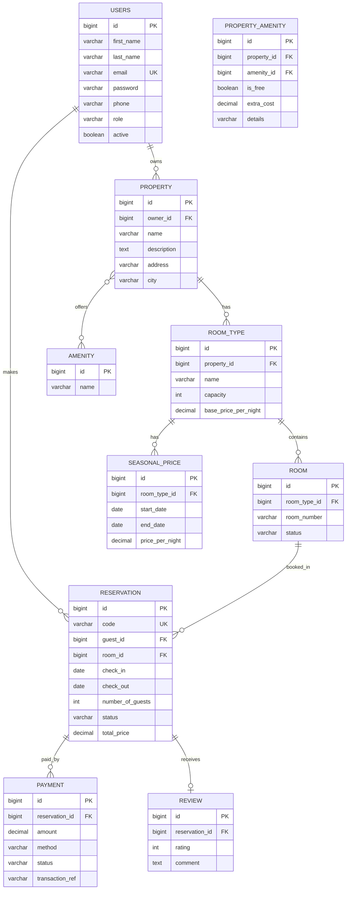

# Sistema de reserva para hostales y tours

Se usa API REST para la gestión e reservas de hoteles, construido con **Spring Boot**. Este sistema permite a los huéspedes buscar si hay habitaciones disponibles por fechas, reservar, pagar y dejar reseñas, por la parte de los propietarios les permite administrar sus propiedades, los tipos de habitaciones y termporadas de precios.

Este proyecto nace a partir del contexto turístico de Santa Marta, Colombia donde según por temporada la demanda tiene bastantes variaciones (diciembre, semana santa, puentes festivos), y por este motivo incluye precios por temporada y control estricto de disponibilidad.

**Estado:** Este proyecto está en desarrollo activo. Para mirar su avance consultar en el [roadmap](#-roadmap).

## Funcionalidades del proyecto

**Autenticación y autorización** con JWT y roles como GUEST, OWNER, ADMIN.

**Gestión de hostales** propiedades, comodidades, tipos de habitación y habitaciones físicas.

**Precios por temporada** acá tenemos a la tarifa base, más tarifas especiales por rango de fechas.

**Búsqueda de disponibilidad** por fechas y número de huéspedes.

**Reservas con ciclo de vida completo** `PENDING -> CONFIRMED -> CHECKED_IN -> COMPLETED`, con cancelación desde `PENDING` o `CONFIRMED`.

**Prevención de doble reservas** con validación transaccional con bloqueo pesimista y restricción de exclusión es postgreSQL.

**Pagos simulados** con soporte para pagos parciales y reembolsos.

**Notificaciones por correo** al confirmar o cancelar una reserva.

**Reseñas** de huéspedes vinculadas a reservas completadas.

**Documentación interactiva** con Swagger UI.

## Tecnologias y dependencias

| Área | Tecnología |
|------|------------|
|Lenguaje| Java 21|
|Framework|Spring boot 4.1(Web MVC, Data JPA, Validation, Actuator)|
|Seguridad|Spring security + JWT|
|Base de datos|PostgreSQL|
|Migraciones|Flyway|
|Mapeo de DTOs|MapStruct|
|Correo|Spring mail|
|Documentación|springdoc-openapi (Swagger UI)|
|Pruebas|Junit 5 + Mockito + Testcontainers + Lombok|
|Utilidades|Lombok|
|Contenedores|Docker + Docker Compose|

## Diagrama de relaciones / base de datos



## Estructura del proyecto

El código está organizado por modelos funcionales.

```
src/main/java/com/netbooks/
├── config/          # Seguridad, OpenAPI, correo
├── security/        # JWT, filtros, UserDetailsService
├── common/          # Excepciones, DTOs y entidades base
├── user/            # Usuarios y roles
├── auth/            # Registro y login
├── property/        # Hostales y comodidades
├── room/            # Tipos de habitación, habitaciones y precios
├── reservation/     # Reservas y disponibilidad
├── payment/         # Pagos
├── review/          # Reseñas
└── notification/    # Correos y eventos
```

## Control de dobles reservas

Dos reservas se solapan si `checkIn < otroCheckOut AND checkOut > otroCheckIn`. Para garantizar que nunca ocurra, incluso con peticiones concurrentes, se aplican dos capas:

1. **Capa de servicio:** consulta de reservas solapadas dentro de una transacción con bloqueo pesimista (`@Lock(PESSIMISTIC_WRITE)`).
2. **Capa de base de datos:** restricción de exclusión en PostgreSQL con `daterange` y la extensión `btree_gist`.

## Ejecución

Para poder ejecutar este proyecto es necesario tener Java 21, Maven 3.9+ y Docker / Docker compose.

## Pasos 

```bash
#1. Clonar el repositorio 
git clone https://github.com/ggarcia0zzz/stayroute.git
cd stayroute

#2. Levantar el postgresql
docker compose up -d

#3. Ejecutar la aplicación
./mvnw spring-boot:run
```
Cuando la aplicación esté corriendo:

- **API:** http://localhost:8080
- **Swagger UI:** http://localhost:8080/swagger-ui.html
- **Health check:** http://localhost:8080/actuator/health

### Pruebas

```bash
./mvnw test
```

Las pruebas de integración usan Testcontainers, por lo que necesitan Docker en ejecución.

## 🗺️ Roadmap

- [x] Configuración inicial del proyecto y dependencias
- [ ] Docker Compose con PostgreSQL y migraciones con Flyway
- [ ] Usuarios, registro y login con JWT y roles
- [ ] CRUD de hostales, tipos de habitación y habitaciones
- [ ] Búsqueda de disponibilidad por fechas
- [ ] Creación, cancelación y consulta de reservas
- [ ] Pagos simulados y notificaciones por correo
- [ ] Reseñas
- [ ] Pruebas unitarias y de integración
- [ ] CI/CD con GitHub Actions
- [ ] Despliegue en la nube

## Autor

**Gabriela Garcia**

[LinkedIn] www.linkedin.com/in/gabriela-garcia-orozco-91ab41439

[GitHub] https://github.com/ggarcia0zzz